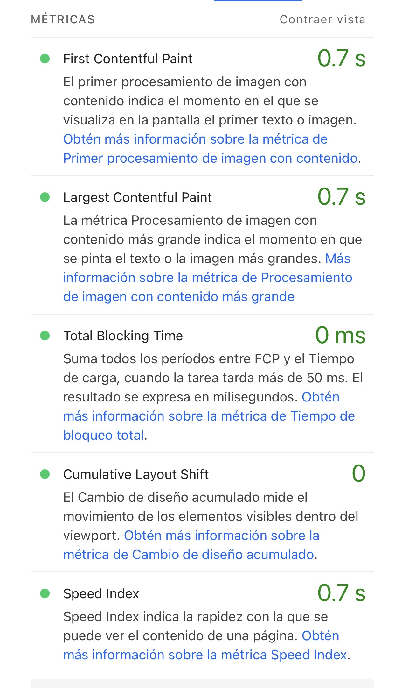

#  Fast Restaurant - Sistema de Gestión de Cafetería

### Integrantes
* Aguilar Lima Samuel Alejandro 
* Torres Hernández Mariel 

Este proyecto es una plataforma web en la nube (SaaS) pensada para conectar todas las áreas operativas de un restaurante. No es solo una caja registradora común; construimos un motor de auditoría inteligente que une las ventas con la barra y el almacén para que el negocio automatice su inventario, evite pérdidas y cuide sus finanzas en tiempo real.

---

## 2. Planteamiento del Problema
### 2.1 Levantamiento de Requerimientos (Entrevista Completa con el Cliente)

Para entender a fondo las necesidades operativas del negocio y diseñar la estructura exacta de las tablas, relaciones y restricciones de la base de datos, realizamos una sesión de trabajo extendida con el dueño de un restaurante local con planes inmediatos de expansión. A continuación se presenta la transcripción íntegra y detallada de la entrevista:

> **Equipo de Desarrollo:** "Hola, buenas tardes. De verdad muchas gracias por abrirnos un espacio en tu agenda hoy aquí en el restaurante, sabemos que las horas previas al servicio de comida son una locura. Como te adelantamos por mensaje, el propósito de esta reunión es ir al grano, rascar en el fondo de tu operación y entender exactamente cómo funciona el negocio para que el sistema no sea un software genérico, sino un traje hecho a tu medida. Para romper el hielo, dinos: ¿Cuál es tu verdadero dolor de cabeza en el día a día al administrar este lugar y qué es lo que más te quita el sueño al pensar en abrir nuevas sucursales?"
> 
> **Dueño del Restaurante:** "Hola, muchachos, qué gusto tenerlos por acá. Bienvenidos, pasen. Miren, hablándoles con el corazón en la mano y con total franqueza: mi mayor dolor de cabeza es que opero completamente a ciegas. Si ustedes entran a mi oficina, van a ver pantallas, computadoras y tecnología, pero el verdadero problema es que toda la información está rota, fragmentada y amarrada por separado. Actualmente, este restaurante funciona como si fueran tres negocios chiquitos, independientes y totalmente aislados conviviendo a la fuerza bajo el mismo techo. No se hablan entre sí."
> 
> **Equipo de Desarrollo:** "A ver, esa analogía de los tres mundos aislados está muy interesante. ¿Nos podrías desmenuzar exactamente cómo es el flujo de un insumo y dónde empieza a romperse esa comunicación entre tus áreas?"
> 
> **Dueño del Restaurante:** "Claro que sí, es muy fácil de ver pero dificilísimo de controlar manualmente. Miren, el primer mundo es la Logística y el Almacén. Ahí es donde yo compro las materias primas en grande, en macrounidades. A mí me llegan bultos de harina de 25 kilos, cajas con piezas de carne al vacío de 10 kilos, cajas de verduras por rejas, galones de aceite. Todo eso entra a mi bodega y yo lo registro en una libreta o en carpetas de Excel basándome puramente en lo que dicen las facturas de los proveedores. Hasta ahí, los números cuadran en el papel. El problema viene cuando pasamos al segundo mundo: el Área de Producción, que es mi cocina. Mis cocineros no preparan los platillos usando bultos ni cajas completas; ellos operan en microunidades. Para hacer una hamburguesa usan 150 gramos de carne molida, dos rebanadas de tomate, 20 mililitros de aderezo. Toda esa alquimia se maneja con recetarios. ¿Cuál es el problema? Que esos recetarios rara vez están digitalizados; están anotados en una libreta grasienta en la cocina o simplemente viven en la mente del chef. Y luego tenemos el tercer mundo: el Piso de Ventas. Ahí tengo a los meseros cobrando con un punto de venta (POS) tradicional que lo único que hace es registrar productos terminados. Al final de la jornada, la caja me imprime un ticket que dice: 'Hoy vendiste 40 hamburguesas con papas y 15 cortes de carne'. Ok, perfecto, ¿pero eso cuántos bultos de harina, cuántos kilos de carne y cuántos litros de aderezo significó en mi almacén bruto? No tengo la menor idea. No hay un puente."
> 
> **Equipo de Desarrollo:** "Claro, hay un vacío enorme en medio de tu flujo operativo. Tu punto de venta registra el producto final que se come el cliente, pero tu almacén solo sabe lo que compraste hace dos semanas. No hay nada que traduzca las ventas en insumos crudos al momento."
> 
> **Dueño del Restaurante:** "¡Exactamente! Ese es mi bendito punto ciego. Al no tener una base de datos centralizada que sea capaz de hacer esa traducción automática en milisegundos, yo como gerente me veo obligado a tomar decisiones financieras adivinando o por pura intuición. Y esa falta de comunicación en los datos me genera tres crisis inmediatas que me desangran la utilidad neta del negocio mes con mes."
> 
> **Equipo de Desarrollo:** "Mencionaste tres crisis específicas hace un momento. ¿Nos podrías detallar la primera, la que tiene que ver con los márgenes de ganancia?"
> 
> **Dueño del Restaurante:** "La primera es la opacidad total en la rentabilidad de mis platillos. El costo de la carne, del jitomate, del aguacate y del aceite cambia a cada rato; los proveedores me suben los precios de una semana a otra por la inflación o la temporada. Como no tengo un sistema donde el costo dinámico de lo que compro en el almacén esté amarrado directamente al precio final que ve el cliente en el menú, es humanamente imposible calcular mi margen de ganancia real por cada platillo. No sé si hoy ganarle el 30% a la hamburguesa es real o si ya le estoy perdiendo dinero por el aumento del pan. Termino poniendo los precios del menú copiando a la competencia de enfrente o por lo que me dicta el instinto, lo cual es peligrosísimo."
> 
> **Equipo de Desarrollo:** "Entendido. ¿Y qué pasa con la segunda crisis? Habías comentado algo sobre las mermas y el comportamiento del personal en inventarios."
> 
> **Dueño del Restaurante:** "Uf, esa es la que más me corroe y me da coraje: los robos hormiga y las mermas descontroladas. Como las ventas que marcan los meseros no descuentan de inmediato el inventario crudo de la bodega en tiempo real, yo no tengo un parámetro físico ni matemático para saber cuánto producto debería quedar en las cámaras de refrigeración. Si el sistema no sabe cuánta carne debió usarse hoy, no puedo auditar. Al final de la semana voy a la bodega, hago un conteo físico y resulta que me faltan 4 kilos de arrachera o tres botellas de licor. Cuando confrontó al personal de cocina o barra, la respuesta siempre es la misma: 'Ay jefe, es que esa carne se echó a perder y la tiramos', o 'Es que calculamos mal las porciones en el turno del martes y se desperdició', o el clásico 'Fue un error de cuenta, la otra semana se empareja'. Es una ventana enorme para el robo o para el descuido total, porque saben que no tengo cómo contradecirlos ni comprobarles si es verdad o mentira. Me tengo que tragar sus excusas."
> 
> **Equipo de Desarrollo:** "Es una fuga de dinero silenciosa porque no tienes herramientas de auditoría. ¿Y la tercera crisis cómo afecta la experiencia del cliente en el comedor?"
> 
> **Dueño del Restaurante:** "Es la saturación en la comunicación y la lentitud del servicio. Al depender de procesos manuales, de andar revisando los refrigeradores a ojo o de usar bitácoras en papel que se llenan a mano cuando alguien se acuerda, el flujo de trabajo es pesadísimo. Si el mesero no sabe que ya no hay un ingrediente porque nadie actualizó el stock, le toma la orden al cliente, va a la cocina, el cocinero le grita que ya no hay, el mesero regresa con el cliente a pedirle que cambie su platillo... Todo ese teléfono descompuesto atrasa la comida, la mesa se molesta, los tiempos de espera se duplican y pierdo capacidad de rotación en el comedor. En hora pico, la cocina se vuelve un infierno de gritos y papeles perdidos."
> 
> **Equipo de Desarrollo:** "Nos queda clarísimo el diagnóstico. El problema es de datos e integridad. Ahora bien, visualiza el software ideal para tu restaurante. Si tuvieras una varita mágica, ¿cómo solucionaría el sistema cada uno de estos problemas en tu día a día?"
> 
> **Dueño del Restaurante:** "Miren, mi escenario perfecto es que el sistema haga el trabajo pesado en automático y actúe como un policía digital de mis recursos. Quiero una plataforma web en la nube, bajo un modelo SaaS, para poder revisar el restaurante desde mi teléfono o mi computadora sin tener que estar físicamente metido aquí todo el día. Lo que necesito es un motor de auditoría integral. El flujo ideal sería este: un mesero llega a la mesa con una tablet o desde su interfaz, selecciona que la Mesa 5 quiere una Hamburguesa Especial y le da a 'Cobrar'. En ese mismísimo milisegundo, quiero que el sistema corra en el fondo de la base de datos, busque la receta digital de esa hamburguesa, vea que consume 150 gramos de carne, 30 gramos de queso y un pan, y los reste directamente del stock actual del almacén central. Así de simple: un inventario inteligente que se descuente solo con cada transacción."
> 
> **Equipo de Desarrollo:** "Excelente. Y para la entrega de cuentas y el manejo de efectivo al cierre del día, ¿cómo te imaginas esa funcionalidad?"
> 
> **Dueño del Restaurante:** "Al final del turno, el sistema debe darme una hoja de conciliación perfecta. Debe cruzar tres variables: lo que el punto de venta dice que se vendió en dinero, lo que las recetas dicen que debió gastarse en insumos primarios, y lo que físicamente hay en el refrigerador y en la caja de efectivo. Si hay un desfase de dinero o de comida, el sistema no debe dejar cerrar el turno de forma limpia; debe levantar una alerta roja, calcular la diferencia exacta y registrar con nombre y apellido qué cajero y qué empleados estaban logueados en ese turno para poder fincar responsabilidades directas. Se acabaron los 'se perdió' o 'calculamos mal'."
> 
> **Equipo de Desarrollo:** "Perfecto. Mencionaste al principio que tu plan es expandirte y abrir más sucursales. ¿Cómo debe comportarse el sistema cuando des ese paso?"
> 
> **Dueño del Restaurante:** "Esa es la clave para que el negocio escale. Necesito que el sistema sea multi-sucursal pero completamente privado. Yo quiero entrar con mi cuenta de administrador global y poder ver las métricas financieras de mis tres o cuatro restaurantes al mismo tiempo desde un solo panel. Pero si yo doy de alta a un gerente o a un mesero para la Sucursal A, la base de datos debe tener un candado absoluto que le impida ver, modificar o cruzarse con los inventarios, las ventas o los empleados de la Sucursal B. Cada restaurante debe operar en su propio entorno seguro, pero centralizado bajo mi control. Necesito que los datos estén sincronizados al instante en la nube para saber exactamente dónde y cómo se está moviendo cada peso de mi inversión."


### 2.2 Descripción de la Problemática
El gran reto de los restaurantes hoy en día no es la falta de tecnología, sino que la información está completamente amarrada por separado. Un negocio promedio funciona como tres mundos aislados bajo el mismo techo[:
* **Logística y Almacén:** Compra en grande y solo registra entradas basándose en facturas.
* **Área de Producción :** Procesa y sirve los productos usando microunidades (gramos, mililitros) siguiendo recetas que casi siempre están en papel o en la mente del barista.
  * **Piso de Ventas:** Genera los ingresos cobrando productos terminados mediante un punto de venta tradicional.

**El punto ciego:** Al no haber una base de datos centralizada que traduzca automáticamente esos productos comprados en los gramos que se sirven y las porciones que se venden, el dueño toma decisiones financieras a ciegas. Esto provoca tres crisis inmediatas:
1. **Margen de ganancia oculto:** Como el precio de la materia prima cambia constantemente con los proveedores, es casi imposible saber cuánto se gana realmente por platillo  vendido; las decisiones del menú se toman por intuición.
2. **Robos hormiga y desperdicios:** Como las ventas de los meseros no descuentan el inventario crudo al instante, no hay un parámetro real para saber cuánto insumo debería quedar físicamente en la bodega. Esto da pie a mermas ocultas o descuidos que el personal justifica como "errores de cuenta".
3. **Atención lenta:** Depender de bitácoras manuales o notas de papel para actualizar existencias o pasar pedidos atrasa todo el servicio en el restaurante.

### 2.3 Levantamiento de Requerimientos
Para solucionar esto, diseñamos el sistema enfocándonos en las siguientes necesidades clave:
**Inventario automático:** En el momento exacto en que un mesero cobra un pedido, el sistema consulta la receta y descuenta de forma automática los ingredientes base del almacén.
***Cuentas claras:** La plataforma cruza lo vendido en el turno con lo que físicamente sobra en el refrigerador y el dinero real en caja. Si falta algo, el sistema detecta la diferencia y muestra quién estaba a cargo.
* **Multi-sucursal segura:** Varias cafeterías o sucursales pueden registrarse en la misma página, pero la base de datos aísla la información para que ningún negocio pueda ver los datos de otro.

---

## 3. Diseño Conceptual

### 3.1 Identificación de Entidades
Para estructurar la base de datos, identificamos estas piezas (entidades) esenciales para el negocio:
* **RESTAURANTE :** El negocio principal.
* **EMPLEADO:** Todo el personal que labora en el lugar.
* **CAJA:** El módulo donde se procesa el dinero en efectivo y se auditan montos.
* **PEDIDO:** La cuenta o comanda asignada a una mesa.
* **MESA:** El espacio físico del salón.
* **PLATILLO:** Los productos del menú que se ofrecen al cliente.
* **COMPONENTE:** Los insumos en stock .
* **MOVIMIENTO:** El registro de entradas y salidas (Compras, Ventas, Ajustes, Mermas).
* **PROVEEDOR:** Quienes surten los insumos base.

### 3.2 Relaciones y Cardinalidades
* Un **Restaurante** contrata de 1 a muchos **Empleados**.
* Un **Mesero** puede atender de 0 a muchos **Pedidos**.
* Un **Platillo** se compone de 1 a muchos **Componentes de Receta**.
* Un **Empleado** autoriza o registra de 0 a muchos **Movimientos** de almacén.

### 3.3 Jerarquía ISA
Dividimos a los **Empleados** en tres roles específicos para segmentar la seguridad y los accesos en el sistema:
* **Administrador:** Cuenta con usuario y contraseña exclusivos para gestionar las finanzas y auditar el negocio.
* **Mesero:** Tiene asignada una zona específica del salón para levantar pedidos.
* **Cocinero / Barista:** Cuenta con un rango y especialidad asignada en la barra.

### 3.4 Entidades Débiles
* **DETALLE_PEDIDO:** No puede existir si no hay un **Pedido** activo; se encarga de guardar renglón por renglón los platillos servidos en una comanda.
* Tablas secundarias como **TELEFONO_RESTAURANTE** o **EMAIL_PROVEEDOR**, las cuales dependen directamente de sus entidades fuertes para almacenar múltiples contactos.

### 3.5 Diagrama EER
Este es el mapa conceptual en el que organizamos todas las reglas del negocio antes de pasar al código:


---

## 4. Modelo Relacional

### 4.1 Estrategia de Transformación
Para pasar del modelo conceptual a tablas reales, seguimos reglas de normalización estándar. Las entidades fuertes se convirtieron en tablas independientes. La jerarquía de empleados se resolvió creando tablas hijas que heredan el `id_empleado` como llave primaria. Las relaciones de muchos a muchos (como los ingredientes de un platillo) las rompimos con tablas intermedias usando llaves compuestas.

### 4.2 Tablas Resultantes del Esquema Relacional
Así se estructuraron las tablas principales de nuestra base de datos:
* `RESTAURANTE` (`id_restaurante`, nombre, razon_social) 
* `EMPLEADO` (`id_empleado`, nombre, telefono, salario_base, id_restaurante) 
* `PEDIDO` (`folio_pedido`, hora_apertura, hora_cobro, estado, metodo_pago, id_empleado, id_mesa) 
* `DETALLE_PEDIDO` (`folio_pedido`, `num_linea`, cantidad_servida, precio_unitario, id_platillo) 

### 4.3 Diagrama del Modelo Relacional
Este plano técnico detalla las tablas finales y cómo se amarran entre sí mediante llaves primarias (PK) y llaves foráneas (FK)[cite: 98]:


### 4.4 Diccionario de Datos
* `id_empleado`: Código numérico único para identificar a cada trabajador (PK).
* `folio_pedido`: Número de folio secuencial para cada comanda o cuenta (PK).
* `stock_actual`: Cantidad exacta de insumo disponible en almacén expresado en microunidades.

---

## 5. Implementación — DDL y Restricciones de Dominio

### 5.1 Sistema Gestor de Base de Datos
Elegimos **PostgreSQL** alojado en la plataforma **Supabase**. Esto nos da un motor relacional en la nube muy rápido, seguro y capaz de manejar múltiples conexiones al mismo tiempo.

### 5.2 Creación del Esquema — DDL Principal

 Está diseñado en PostgreSQL (Supabase) e incluye las llaves primarias, foráneas y las relaciones necesarias para que todo el flujo del restaurante quede conectado en automático, el codigo se puede ver en los archivos del repositorio.


### 5.5 Consultas Avanzadas y Vistas de Auditoría (Views)

Con la finalidad de dotar al administrador de herramientas analíticas de control financiero accesibles desde la aplicación web, creamos tres vistas clave:

```sql
-- 1. Vista de Costos Reales de Recetas vs Margen de Ganancia del Menú
CREATE OR REPLACE VIEW vista_costos_platillos AS
SELECT 
    p.id_platillo,
    p.nombre AS platillo,
    p.categoria,
    p.precio AS precio_venta,
    SUM(cr.cantidad_requerida * COALESCE(pi.precio, 0)) AS costo_produccion_insumos,
    p.precio - SUM(cr.cantidad_requerida * COALESCE(pi.precio, 0)) AS utilidad_neta_estimada,
    ROUND(((p.precio - SUM(cr.cantidad_requerida * COALESCE(pi.precio, 0))) / p.precio) * 100, 2) AS porcentaje_rendimiento
FROM platillo p
INNER JOIN componente_receta cr ON p.id_platillo = cr.id_platillo
LEFT JOIN (
    -- Subconsulta para obtener el precio promedio de insumos por proveedor
    SELECT id_componente, AVG(precio) as precio 
    FROM proveedor_insumo 
    GROUP BY id_componente
) pi ON cr.id_componente = pi.id_componente
GROUP BY p.id_platillo, p.nombre, p.categoria, p.precio;

-- 2. Vista de Insumos Críticos bajo el Umbral de Seguridad
CREATE OR REPLACE VIEW vista_insumos_criticos AS
SELECT 
    id_componente,
    nombre AS insumo,
    stock_actual,
    stock_minimo,
    unidad_medida,
    (stock_minimo - stock_actual) AS deficit_requerido
FROM componente
WHERE stock_actual <= stock_minimo;

-- 3. Vista de Cuadre Financiero y Auditoría de Cajas por Turno
CREATE OR REPLACE VIEW vista_resumen_cajas AS
SELECT 
    c.id_caja,
    c.fecha_apertura,
    e.nombre AS administrador_a_cargo,
    c.fondo_inicial,
    COALESCE(SUM(dp.cantidad_servida * dp.precio_unitario), 0) AS total_ventas_sistema,
    c.fondo_inicial + COALESCE(SUM(dp.cantidad_servida * dp.precio_unitario), 0) AS balance_esperado_cierre,
    c.monto_cierre AS balance_real_entregado,
    c.monto_cierre - (c.fondo_inicial + COALESCE(SUM(dp.cantidad_servida * dp.precio_unitario), 0)) AS desviacion_efectivo
FROM caja c
INNER JOIN empleado e ON c.id_empleado_admin = e.id_empleado
LEFT JOIN pedido p ON p.hora_apertura >= c.fecha_apertura AND p.estado = 'Cobrado'
LEFT JOIN detalle_pedido dp ON p.folio_pedido = dp.folio_pedido
GROUP BY c.id_caja, c.fecha_apertura, e.nombre, c.fondo_inicial, c.monto_cierre;
```

---

## 6. Arquitectura Completa del Sistema

### 6.1 Stack Tecnológico
* **Frontend (Capa de Presentación):** Diseñado con interfaces reactivas basadas en HTML5 semántico, CSS3 modular avanzado y JavaScript vainilla síncrono/asíncrono embebido. Todo el entorno está compilado e integrado de manera eficiente bajo el empaquetador **Vite**, asegurando tiempos de carga menores a 1.5 segundos en dispositivos móviles y terminales POS del restaurante.
* **Backend y Base de Datos (Capa de Datos):** Axfixiado nativamente en **PostgreSQL 15** administrado y desplegable sobre la infraestructura en la nube de **Supabase**. Las peticiones se procesan mediante llamadas directas a través de una API RESTful generada automáticamente por PostgREST, eliminando capas intermedias lentas y permitiendo actualizaciones inmediatas de transacciones comerciales.
* **Hosting (Despliegue Continuo):** Alojado en **Vercel** acoplado a un pipeline de integración continua (CI/CD) conectado directamente a nuestro repositorio central de GitHub.

### 6.2 Módulos Funcionales Integrados y Capturas de Pantalla
El diseño de la aplicación web se fragmentó en subsistemas especializados que interactúan directamente con las restricciones del modelo relacional:

<table align="center" width="100%">
  <tr>
    <td align="center" width="50%">
      <h3> Salón Principal</h3>
      <p>Mapeo dinámico del comedor en tiempo real. Ejecuta sentencias SQL <code>UPDATE mesa SET estado = 'Ocupada'</code> de manera interactiva a través del mapa visual, bloqueando o liberando mesas instantáneamente.</p>
      
    </td>
    <td align="center" width="50%">
      <h3>Acceso y Seguridad</h3>
      <p>Capa estricta de inicio de sesión que intercepta credenciales y consulta la tabla heredada <code>administrador</code>. Restringe pantallas operativas evaluando el rol del empleado autenticado.</p>
      
    </td>
  </tr>
  <tr>
    <td align="center" width="50%">
      <h3>Menú y Órdenes</h3>
      <p>Terminal POS digital para comandas. Carga el catálogo de la tabla <code>platillo</code> y procesa la inserción masiva de tuplas en las tablas débiles <code>pedido</code> y <code>detalle_pedido</code> con cálculos automáticos de subtotal.</p>
      
    </td>
    <td align="center" width="50%">
      <h3> Almacén</h3>
      <p>Módulo central de monitoreo de insumos primarios. Despliega alertas dinámicas si el disparador SQL reporta desabasto e integra formularios para la recepción de compras y mermas de stock.</p>
      
    </td>
  </tr>
  <tr>
    <td align="center" width="50%">
      <h3> Personal</h3>
      <p>Panel administrativo exclusivo para la gestión del recurso humano del restaurante. Coordina asignaciones de zonas de meseros, rangos de cocineros y control salarial.</p>
      
    </td>
    <td align="center" width="50%">
      <h3> Finanzas</h3>
      <p>Consola gerencial de rendimientos económicos. Traduce los datos consolidados de las vistas de auditoría de cajas en gráficas visuales para analizar fugas de efectivo u opacidad de mermas.</p>
      
    </td>
  </tr>
</table>

---

## 7. Pruebas de Integridad, Seguridad y Concurrencia

### 7.1 Políticas de Seguridad a Nivel de Fila (RLS) en la Nube

Para implementar de forma nativa la arquitectura Multi-Inquilino (Multi-tenant) requerida por el dueño, activamos la funcionalidad de Row Level Security (RLS) dentro de la base de datos, garantizando aislamiento total entre sucursales de restaurantes


### 7.2 Gestión de Transacciones Concurrentes (Aislamiento ACID)

Para evitar la pérdida de comandas y garantizar que las lecturas de inventarios sean consistentes durante las horas pico del restaurante, el sistema empaqueta cada orden bajo niveles de aislamiento transaccional estrictos (`SERIALIZABLE`):

```sql
-- Simulación de cobro seguro con aislamiento ACID ante alta concurrencia
BEGIN TRANSACTION ISOLATION LEVEL SERIALIZABLE;

    -- 1. Bloquear preventivamente la tupla del pedido para evitar modificaciones externas simultáneas
    SELECT estado FROM pedido WHERE folio_pedido = 1 FOR UPDATE;

    -- 2. Modificar el estado para detonar de forma atómica el disparador de recetas
    UPDATE pedido 
    SET estado = 'Cobrado', metodo_pago = 'Efectivo', hora_cobro = CURRENT_TIMESTAMP 
    WHERE folio_pedido = 1;

    -- 3. Actualizar la disponibilidad física de la mesa asignada en el comedor
    UPDATE mesa SET estado = 'Libre' WHERE id_mesa = (SELECT id_mesa FROM pedido WHERE folio_pedido = 1);

COMMIT;
```

---

## 8. Métricas de Rendimiento y Calidad

Para garantizar los estándares de calidad esperados en una aplicación de software profesional, el sistema fue sometido a una auditoría técnica utilizando **Google PageSpeed Insights** (motor de Lighthouse). 

La evaluación se ejecutó directamente sobre el entorno de producción (Vercel) y no en un entorno de desarrollo local, asegurando que los resultados reflejen fielmente la experiencia real del usuario final. Se optimizaron cuatro pilares fundamentales del desarrollo web moderno:

* ** Rendimiento (Performance):** Tiempos de carga y respuesta rápidos gracias al empaquetado de Vite y a la arquitectura SPA (Single Page Application), la cual interactúa con la base de datos de manera asíncrona sin recargar la página.
* ** Accesibilidad (Accessibility):** Interfaz construida con HTML semántico y un diseño de alto contraste (tema oscuro con acentos de neón) que facilita la lectura y el uso prolongado durante jornadas laborales.
* ** Buenas Prácticas (Best Practices):** Código JavaScript moderno y modular, conexiones seguras y encriptadas (HTTPS) al interactuar con el backend de Supabase, y ausencia de vulnerabilidades web comunes.
* ** SEO:** Estructuración correcta de meta-etiquetas y jerarquía de encabezados (`<h1>`, `<h2>`), cumpliendo con las normativas estándar de los motores de búsqueda.

### Reporte Oficial

| ⚡ Resultados de la Auditoría (Desktop) |
| :---: |
|  |

---

## 9. Conclusiones y Trabajo Futuro

El desarrollo del sistema de gestión comercial **Fast Restaurant**, diseñado y estructurado de forma conjunta por nuestro equipo, nos permitió llegar a las siguientes conclusiones técnico-operativas:

* **Resolución Eficiente del Modelo de Datos:** Logramos transformar por completo la problemática del restaurante, rompiendo el histórico aislamiento de información que existía entre los almacenes de insumos crudos y las cajas registradoras del piso de ventas. El uso estructurado de una entidad intermedia relacional para el recetario dinámico, complementado con funciones desencadenadoras (`Triggers`), demostró ser la solución definitiva para erradicar las mermas ocultas y el robo hormiga. El sistema es capaz de auditar e identificar desviaciones exactas en gramos o efectivo al cierre de cada jornada de trabajo, cumpliendo con las demandas del cliente.
* **Seguridad y Escalabilidad Multi-Inquilino (SaaS):** Mediante la implementación de políticas avanzadas de Seguridad a Nivel de Fila (`Row Level Security`), la base de datos centralizada garantiza un aislamiento absoluto de los registros comerciales para múltiples sucursales de restaurantes. Esto le permite al dueño expandir su modelo de negocio de forma segura en la nube sin comprometer la privacidad informática ni mezclar las finanzas de las diferentes sedes operativas.
* **Perspectivas de Trabajo Futuro:** Como ruta de mejora del software a mediano plazo, proyectamos la integración de un módulo inteligente para la predicción de compras basado en algoritmos de aprendizaje automático. Esto permitirá que el sistema analice los historiales de ventas de la base de datos para sugerir automáticamente las órdenes de compra necesarias a los proveedores antes de que ocurra una alerta de desabasto, optimizando por completo los flujos de capital del restaurante.

---

### 🔗 Enlaces del Proyecto
* **Código Fuente:** [Repositorio en GitHub](https://github.com/samLimsx/proyecto-bases.git)
* **Demo en Vivo:** [Página Web en Vercel](https://proyecto-bases-snowy.vercel.app/)
* **Demo estatica en Vivo:** [Página Web estatica en Vercel](https://proyecto-bases-git-version-estatica-samlimsxs-projects.vercel.app/)
* **Usuario de prueba:** `admin@prueba.com`
* **Contraseña:** `admin`
